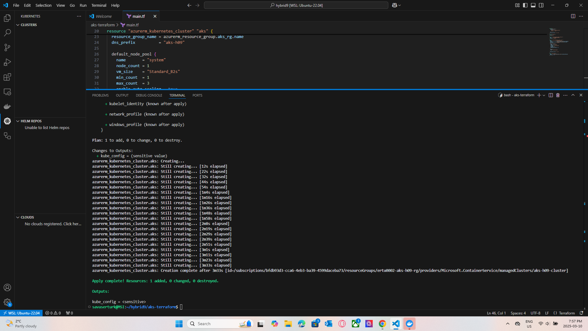
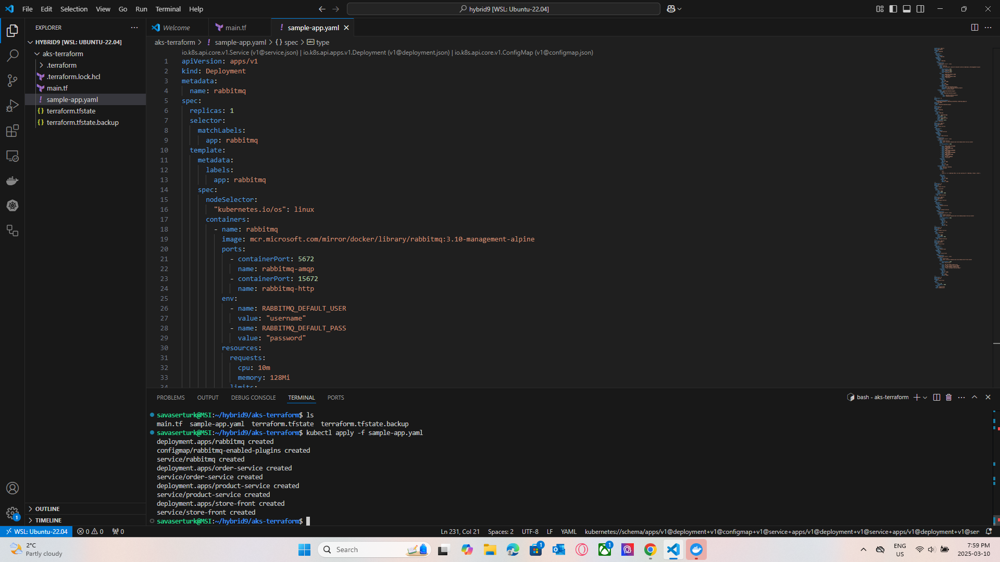

# Terraform AKS Deployment

This repository contains Terraform configurations for deploying an Azure Kubernetes Service (AKS) cluster.

## 📸 Screenshots
Here are some screenshots of the project:

### Screenshot 1


### Screenshot 2


### Screenshot 3


## 📜 Files in this Repository
- **`main.tf`** - Terraform configuration for AKS deployment.
- **`sample-app.yaml`** - Sample Kubernetes deployment YAML.
- **`.terraform.lock.hcl`** - Terraform dependency lock file.
- **`terraform.tfstate`** - Terraform state file.

## 🛠️ Setup Instructions

### **1️⃣ Clone this repository**
```bash
git clone https://github.com/savaserturk/cst8918-w25-h09.git
cd cst8918-w25-h09

Step 2 -  Initialize Terraform
terraform init
Step 3 -  Apply Terraform configuration
terraform apply
Step 4 - Destroy resources (if needed)
terraform destroy


cst8918-w25-h09/
│── screenshots/         # Folder containing project screenshots
│   ├── screenshot1.png
│   ├── screenshot2.png
│   ├── screenshot3.png
│── main.tf              # Terraform configuration
│── sample-app.yaml      # Sample Kubernetes deployment YAML
│── .terraform.lock.hcl  # Terraform dependency lock file
│── terraform.tfstate    # Terraform state file
│── README.md            # Project documentation


